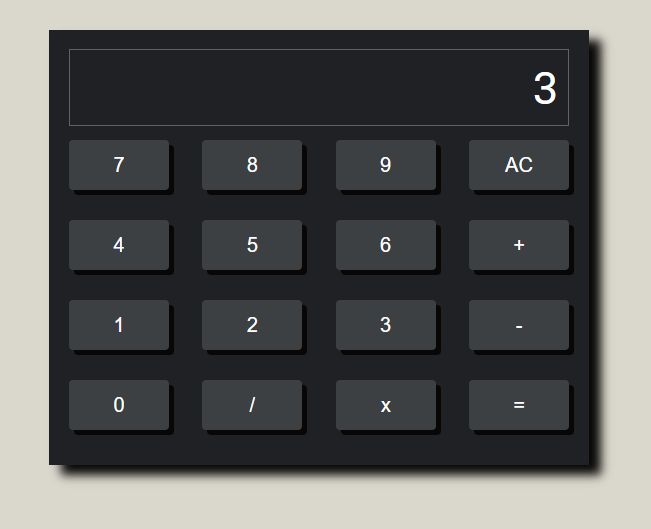

# Site DIO

Status: Finish

## 📎 Sobre

O projeto consiste na criação de uma calculadora de operações simples, proposto durante o ⭐ Bootcamp Orange Tech + ⭐ 

## 🛸 Tecnologias Utilizadas

 
  
  
  
  
  

## 🛠 Prévia 

  
👩‍💻 Visite o projeto: <a href="" rel="Site" target="_blank">Calculadora Simples</a>

