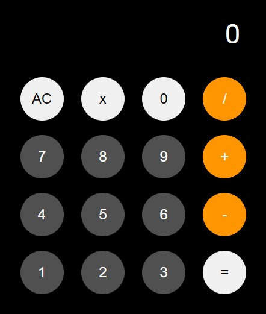

# Calculadora

## 📎 Sobre

O projeto consiste na criação de uma calculadora de operações simples de soma, subtração, multiplicação e divisão.

## 🛸 Tecnologias Utilizadas

- HTML 5
- CSS 3
- JAVA SCRIPT
- REACT

## 🖥️ Demonstração

 

## 🔗 Link da Página

<a href="https://calcimetzker.netlify.app/" rel="Site" target="_blank">Clique aqui para ir para o projeto em execução</a>

## 👾 Créditos

Desenvolvido por: <a href="https://github.com/iMetzker">Ivny Metzker</a>  
Projeto realizando duranto o Bootcamp Orange Tech + da <a href="https://www.dio.me/">DIO</a>

